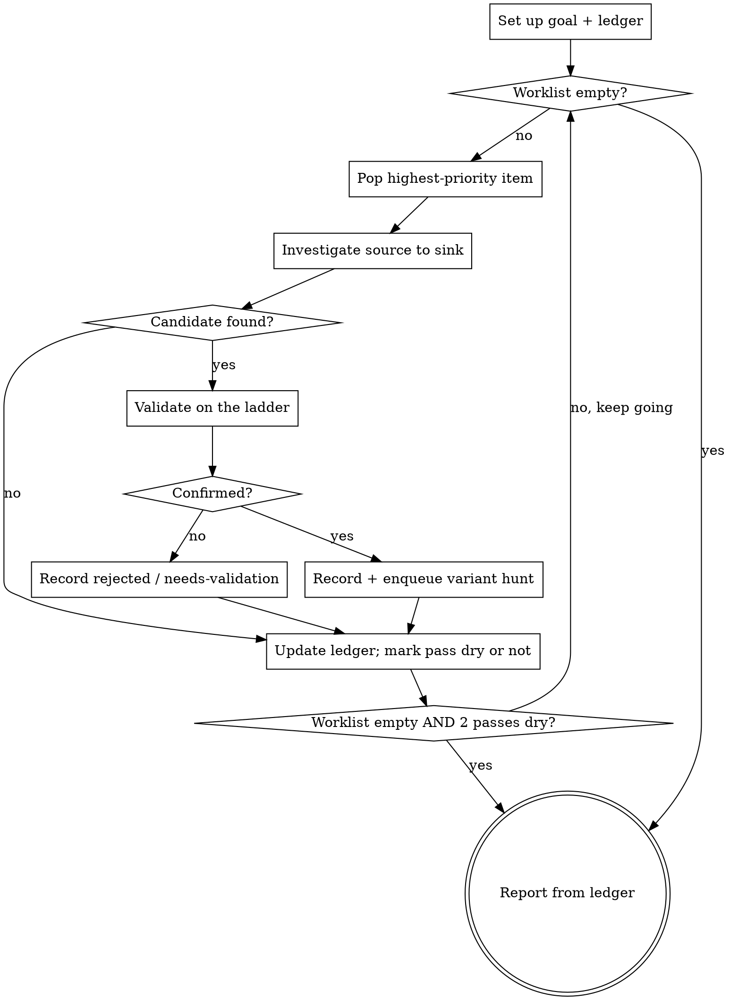

# Security Scan

## Overview

Run authorized, defensive security scans as a goal-driven loop. Register a goal, build a prioritized worklist, then iterate focused passes: investigate, validate, and spawn a variant hunt off every confirmed bug. Keep looping until the worklist drains and recent passes stop finding anything new. A durable ledger holds the worklist and findings so progress survives context resets and large repos.

**Core principle:** one finding is a lead, not a conclusion. Every confirmed bug enqueues a hunt for the same class elsewhere, and the scan is done only when the worklist is empty AND recent passes came up dry. A single sweep is not a scan.

## Authorization and safety (read first)

- Scan only code the user is authorized to assess. Never attack third-party systems, scan public networks, or bypass access controls.
- Read-only by default. Ask before destructive commands, dependency installs, long fuzzing, or anything that touches external services.
- Prove impact defensively: no weaponized exploits, no persistence, no data exfiltration. Keep secrets and full exploit chains out of logs and the report.
- Violating the letter of these rules violates the spirit. No exceptions under time pressure.

## The loop

## Set up: goal + ledger (every run, before investigating)

1. Register a scan **goal** in whatever tracker the session has: Codex goal tools, Claude `TodoWrite`, or `bd`. Phrase it "Defensively scan <scope>, validate findings, report prioritized remediation." Keep one active objective at a time. If no tracker exists, the ledger below IS the tracker.
2. Create a durable **ledger** at `<repo>/SCAN.md` (or a user-given path). It is the loop's memory and must persist across passes and context resets, so write it to a file, never only in your head. Sections: scope and threat model, worklist, findings (confirmed / needs-validation / rejected), coverage, and the dry-pass counter. Template: `references/scan-ledger-template.md`.
3. Seed the worklist: run `python3 <skill>/scripts/rank_repo_files.py <repo> --top 80`, then add the rank-5 and rank-4 files, each entry-point family from `references/risk-signals.md`, and each vulnerability class as worklist items.

## Each pass

Take the highest-priority worklist item as one focused pass. **Prefer a subagent per pass** when sub-agents are available: one investigation target per agent keeps context clean and lets independent passes run in parallel. Fall back to inline passes when sub-agents are not available. The orchestrator (you) owns the worklist, dedupe, validation decisions, and the stop check. Per pass:

1. Investigate: trace source to sink; name the invariant (ownership, bounds, encoding, path root, type, lifetime) and try to falsify it.
2. Validate every candidate with the lowest sufficient rung of the Validation Ladder (`references/scan-playbook.md`). Default to **needs-validation** unless a reachable path and a concrete impact are both shown. This gate is what stops the loop from drowning in pattern-match false positives.
3. On a **confirmed** finding: record it AND enqueue a variant-hunt item, a repo-wide search for the same source/sink shape in other files. One SQL injection enqueues a sweep of every query builder; one missing ownership check enqueues a review of every object lookup.
4. Record rejected hypotheses in one line so later passes do not re-walk them.
5. Update the ledger. If the pass produced no new confirmed finding and no new worklist item, increment the dry-pass counter; otherwise reset it to zero.

## Stop: autonomous until dry

Keep looping without checking in. Stop and write the report when **both** hold: the worklist is empty, and the last **2** passes were dry. Also stop on a hard cap you set at the start (a max-pass or token budget) or when a step is blocked and needs the user (a destructive command, an out-of-scope target, missing authorization). Do not stop just because you found something; a confirmed bug means more passes, not fewer.

## Report

Findings first, ordered by severity, each with file:line, impact, evidence, and remediation. Then coverage (files and surfaces reviewed, commands run), residual risk, and every item still marked needs-validation. Output contract and triage rubric: `references/scan-playbook.md`.

## Quick reference

| Step | Do |
|---|---|
| Start | Register goal; create `SCAN.md` ledger; seed worklist from ranker + surfaces + classes |
| Pass | Subagent (or inline) → investigate source→sink → validate on the ladder → record |
| Confirmed | Enqueue a same-class variant hunt across the whole repo |
| Stop | Worklist empty AND 2 consecutive dry passes (or budget hit, or blocked) |
| Never | Attack third parties; run destructive/exfil steps; weaponize; report a finding without validation |

## Resources

- `references/scan-ledger-template.md` — the durable worklist and findings ledger.
- `references/scan-playbook.md` — goal setup, planning, investigation loop, Validation Ladder, triage, responsible handling, stop conditions.
- `references/risk-signals.md` — high-signal patterns by surface, for seeding passes and variant hunts.
- `scripts/rank_repo_files.py` — rank likely security-sensitive files from 1 to 5.
